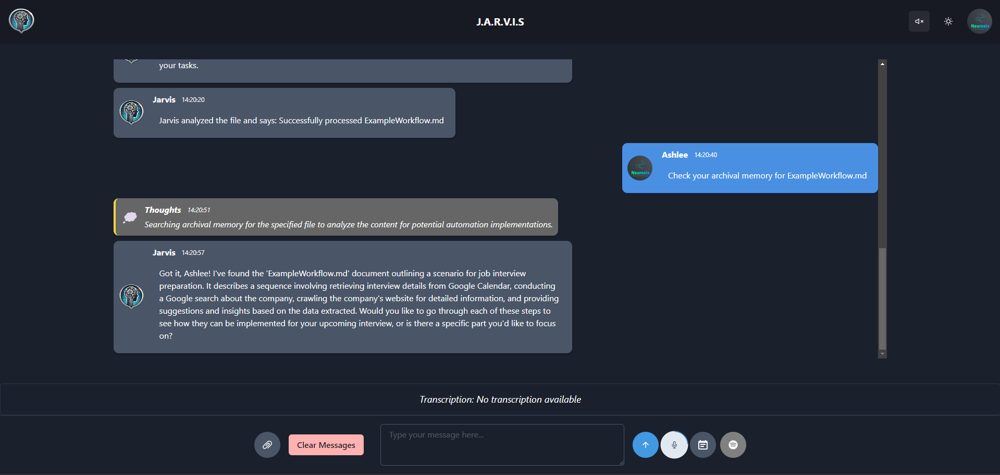
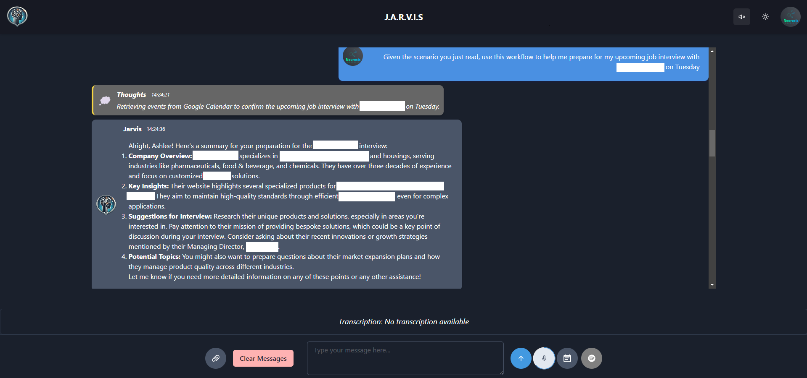
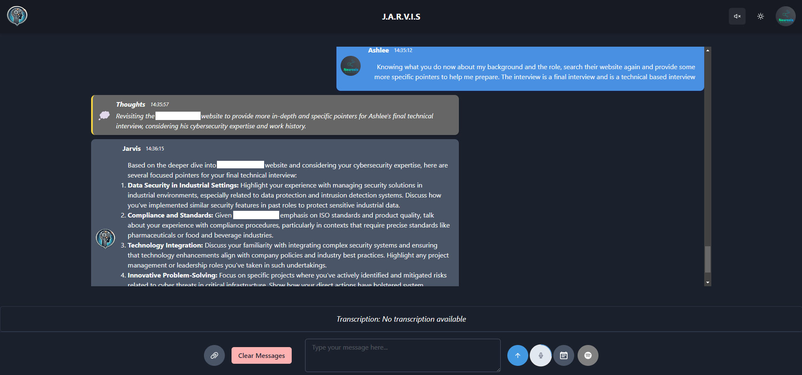

# Example Workflow

Jarvis should be capable of performing complex tasks, as long as the tools we’ve created are integrated correctly and can handle the required operations. Here’s how the MemGPT agent (Jarvis) can manage this scenario by chaining multiple tools together:

## Scenario

Job Interview preparation with a company named "XYZ"

## Breakdown of the Task

1. Retrieving a Job Interview from Google Calendar:

     The agent will first need to call the Google Calendar tool to fetch your schedule and locate the specific job interview.
     This tool could be configured to search for events that contain specific keywords like “interview” or similar, and retrieve the date, time, and the company name associated with that event.

2. Google Search for the Company:

     Once the company name is retrieved from the calendar event, the agent can invoke the Google Search tool to search for relevant information about the company.
     This could include company background, recent news, and key personnel.
  
3. Crawling the Company’s Website:

     After identifying the company and its website from the Google Search results, the agent can then invoke the website crawling tool to scrape and index the content of the company’s site.

     This tool can gather detailed information such as the company’s mission, products, services, or leadership team—anything that might be relevant to the interview.

4. Providing Detailed Suggestions and Pointers:

    Based on the crawled data and search results, the agent could summarize key information that would be useful for the interview.
    
    This might include suggestions like researching specific products, noting recent company announcements, or preparing questions based on the leadership team’s focus.

## Example Flow

Here’s an example of how the agent would chain these tools together in the background:

1. Google Calendar Retrieval:

    The agent uses a function to call your Google Calendar and searches for upcoming events tagged as “interview” or with similar keywords. It retrieves the company name and the interview date.

2. Google Search:

    With the company name, the agent then triggers the Google Search tool to gather basic information and the official website link.

3. Crawling the Website:

    After identifying the company’s website, the agent invokes the web crawling tool to scrape relevant pages, such as the “About Us,” “News,” or “Products” sections.

4. Summarizing and Providing Insights:

    Once the website has been crawled and indexed, the agent uses its LLM capabilities to analyze the content and provide personalized suggestions.

    For instance:

    - Information about the company’s recent projects or key focus areas.
    - Insights into potential questions you might be asked or topics to emphasize based on the company’s mission or leadership team.
    - Pointers on competitors or relevant industry trends based on Google Search results.

## Example Dialogue

Here’s an example of how the agent might respond to a user’s request:

```User: Can you help me prepare for my interview with XYZ Corp next Tuesday?```


Agent: Sure! Let me first check your schedule... I found your interview with XYZ Corp on Tuesday at 10 AM.

   Next, I’ll gather some information about XYZ Corp from Google... I’ve found their website and latest news articles.

   I’m now crawling their website for more details... It looks like they’ve recently launched a new product and their CEO gave an interview last month discussing future growth strategies.

   Here are some pointers for your interview:

   Research their new product, [Product Name], as it seems to be a key focus.
   The CEO mentioned that they are expanding into international markets—might be worth bringing this up.
   Check out their competitors like [Competitor 1] and [Competitor 2] as well.

<div style="display: flex; flex-wrap: wrap;">
  
  
  
</div>