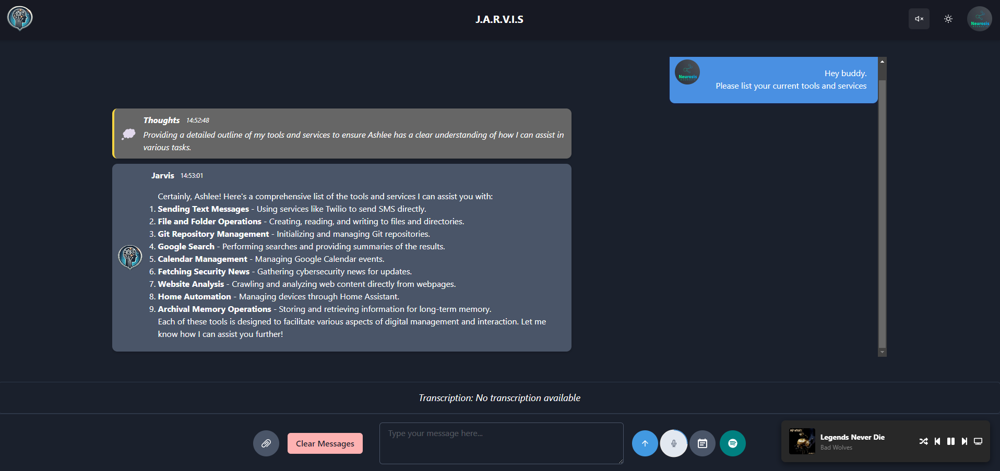
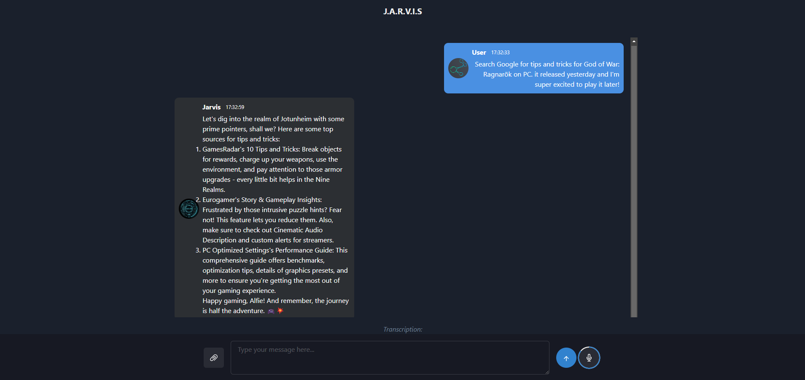
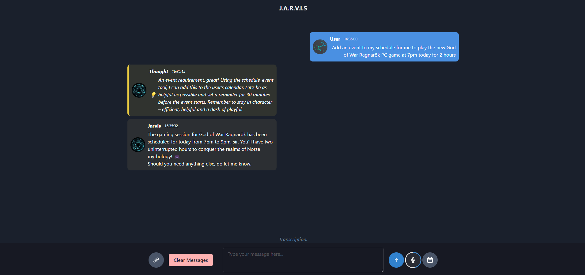
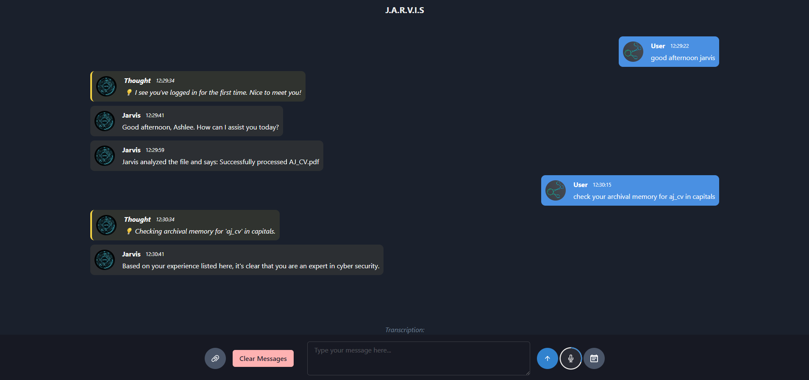
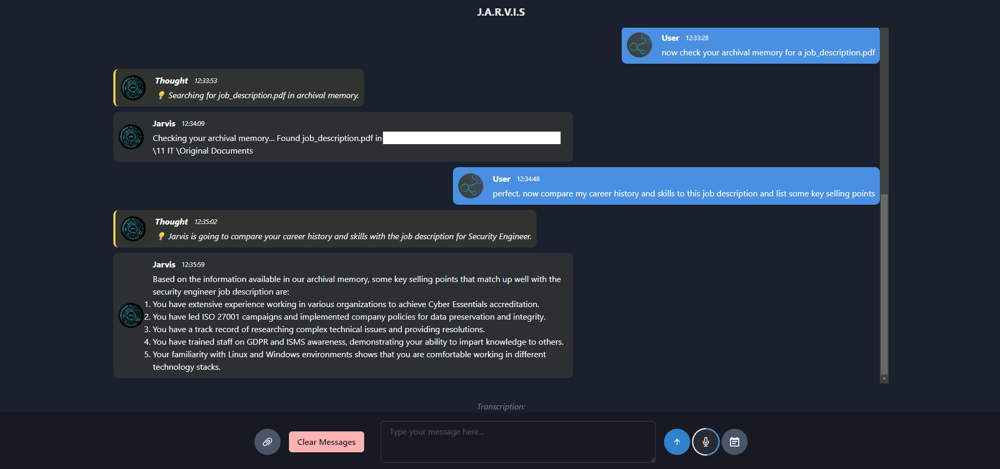
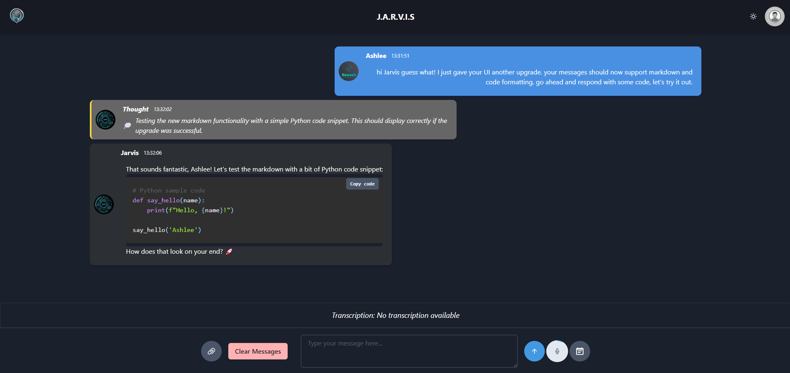

# MemGPT Voice Assistant UI

This is J.A.R.V.I.S, a personal AI assistant created using MemGPT and designed to handle various tasks including sending SMS messages, creating files and folders, conversation and task management, and more. The application is built using a FastAPI backend, with a React frontend and integrated with Elevenlabs for voice functionalities. The frontend is hosted statically within the backend, and the app can be accessed directly through a browser.

<div style="display: flex; flex-wrap: wrap;">
  
  
  
</div>
<div style="display: flex; flex-wrap: wrap;">
  
  
  
</div>

## Features

- Realitic and customisable Text-To-Speech using Elevenlabs.
- Thought messages visually distinct from other messages.
- Markdown support and code linting for messages, including bullet points and formatting.
- SMS messaging integration using Twilio (Currently send only) (WIP).
- Google Search Capabilities.
- Create and initialise Git repositories.
- Ability to use OpenAI/Groq/Custom LLMs and swap custom tools in and out as needed (On Agent creation only).
- File data can be uploaded straight into Archival Memory using the UI.
- MemGPT Data Source connections to chat with your data.
- List upcoming events and create new ones in Google Calendar.
- HTTPS and WSS supported
- Crawl and summarise websites

## Technologies Used

- **Backend**: FastAPI, MemGPT, ElevenLabs, Twilio, Git, GoogleAPI's, Firecrawl
- **Frontend**: React (hosted statically within FastAPI)
- **WebSocket**: Secured Websockt connection for real-time communication between frontend and backend
- **Voice Interaction**: Elevenlabs for text-to-speech synthesis

## Installation

### Prerequisites

- Python 3.10+
- Node.js (only for initial setup, no need to run `npm start`)
- Conda/Venv (optional, for managing dependencies)

#### Clone the Repository

```bash
git clone https://gitlab.com/N3UR0515/memgpt-va-ui.git
cd memgpt-va-ui
```

#### Create missing human.txt file

```bash
touch ./app/backend/human.txt
echo "My name is Alfie" > ./app/backend/human.txt
```

#### Setup the Backend

Install the Python dependencies:

```bash
pip install -r requirements.txt
```

Copy .env-example to .env in the `app/backend` folder and update your credentials:

```bash
cp app/backend/.env-example app/backend/.env
```

#### Build the Frontend

```bash
cd app/frontend
npm run build
```

#### Create the agent
```bash
cd app/backend
python create_agent.py
```

#### Start the app:

```bash
cd app/backend
uvicorn main:app --host 0.0.0.0 --port 8000
```

## Accessing the Frontend

The React frontend is hosted statically through the backend. You can access it by navigating to:

http://localhost:8000/

No need to run npm start, as the frontend files are served directly by FastAPI.

Running on Other Devices
To access the application on another device within your network, ensure your host machine's IP address is reachable, and navigate to:

http://your-ip-address:8000/

### Using the Application

After running the server, you will need to register an account to begin talking to Jarvis.
You can interact with J.A.R.V.I.S via text or voice.
The app uses Elevenlabs for TTS

## Setting up Google Services

To use Google Services you need to set up a Google Cloud Platform account and follow the instructions here: [MemGPT Assistant Example](https://github.com/cpacker/MemGPT/blob/main/examples/personal_assistant_demo/README.md)

## Contact

For any issues or suggestions, feel free to open an issue in the repository or contact me via email.

## DISCLAIMER

I am not a professional Python or React developer and this is just a personal project.

There will be bugs, be warned!